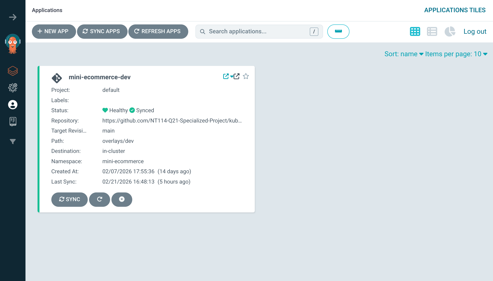
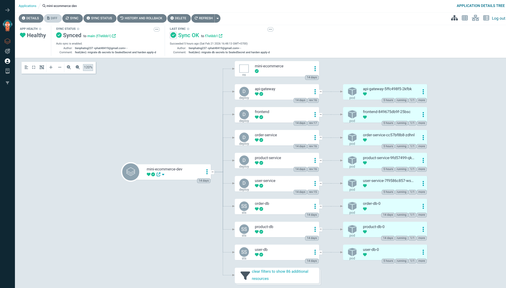
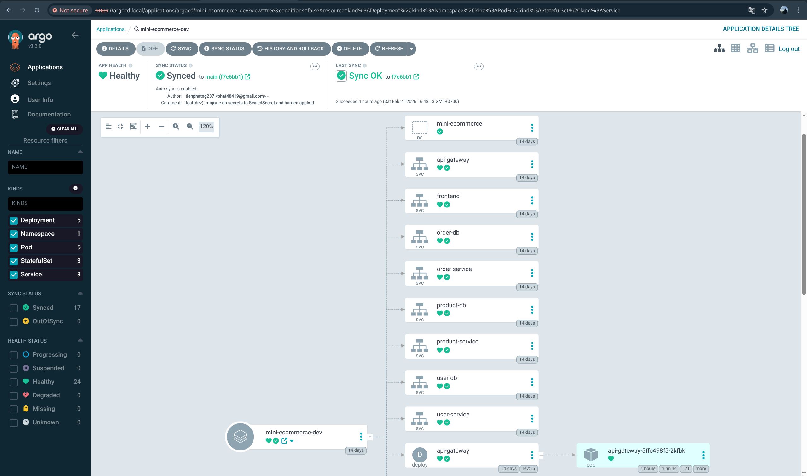
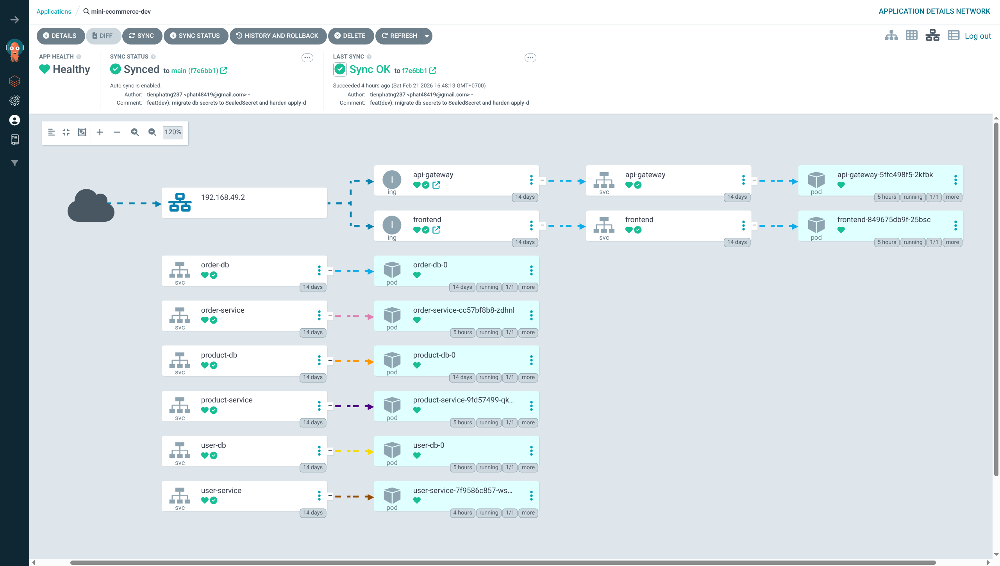

# Kubernetes Hub

This repository contains Kubernetes manifests and GitOps configuration for the [Mini E-commerce system](https://github.com/NT114-Q21-Specialized-Project/mini-ecommerce-microservices).

## 1. ArgoCD Manifests Overview

Contains manifests for setting up ArgoCD in the Kubernetes cluster.

### Dev Environment (Minikube)

All manifests in this repository are currently validated on the development environment using Minikube.

### Application Overview



### Deployment and Namespace



### Services



### Network



## 2. Argo CD Deployment (Dev on Minikube)

### 2.1 Prerequisites

- A running Kubernetes cluster (Minikube for local dev)
- `kubectl`, `helm`, `argocd` CLI (optional but recommended)
- NGINX Ingress Controller installed in the cluster

### 2.2 Install Argo CD Control Plane

```bash
# 1) Create namespace
kubectl create namespace argocd

# 2) Install Argo CD from repository manifest
kubectl apply -n argocd -f argocd/install.yaml

# 3) Wait core components
kubectl -n argocd rollout status statefulset/argocd-application-controller --timeout=300s
kubectl -n argocd rollout status deploy/argocd-server --timeout=300s
kubectl -n argocd rollout status deploy/argocd-repo-server --timeout=300s
kubectl -n argocd rollout status deploy/argocd-applicationset-controller --timeout=300s

# 4) (Optional) Expose Argo CD via ingress host argocd.local
kubectl apply -f argocd/ingress.yaml
```

### 2.3 Access Argo CD

```bash
# 1) Port-forward Argo CD UI/API
kubectl -n argocd port-forward svc/argocd-server 8088:443

# 2) Get initial admin password
kubectl -n argocd get secret argocd-initial-admin-secret \
  -o jsonpath="{.data.password}" | base64 --decode && echo

# 3) (Optional) Login with CLI
argocd login localhost:8088 --username admin --password '<INITIAL_PASSWORD>' --insecure
```

If using ingress locally, map hosts to Minikube IP:

```bash
IP=$(minikube ip)
echo "$IP argocd.local mini-ecommerce.local" | sudo tee -a /etc/hosts
```

### 2.4 Deploy Mini E-commerce Application with Argo CD

```bash
# 1) Create/update Argo CD Application
kubectl apply -f argocd/applications/mini-ecommerce-dev.yaml

# 2) Trigger refresh/sync from CLI (optional)
argocd app get mini-ecommerce-dev
argocd app sync mini-ecommerce-dev
argocd app wait mini-ecommerce-dev --health --sync --timeout 300
```

### 2.5 Verify Deployment

```bash
# Argo CD application status
kubectl -n argocd get applications
kubectl -n argocd get application mini-ecommerce-dev

# Runtime status in target namespace
kubectl get pods,svc,ingress -n mini-ecommerce

# Quick ingress smoke check
curl --resolve mini-ecommerce.local:80:$(minikube ip) http://mini-ecommerce.local/api/users/health
```

## 3. Sealed Secrets (Current Dev Setup)

This repository uses Sealed Secrets for database credentials in GitOps.

```bash
# 1) Install/upgrade Sealed Secrets controller
./scripts/install-sealed-secrets.sh

# 2) Generate sealedsecret.yaml files from local secret.yaml files
./scripts/generate-sealed-secrets.sh

# 3) Apply dev overlay and run bootstrap + smoke checks
./scripts/apply-dev.sh
```

## 4. Sync Conflict Note (When Jenkins Updates Image Tags)

If Jenkins pushes a new `gitops(dev): update image tags ...` commit before your push:

```bash
git fetch origin
git rebase origin/main
git push origin main
```
